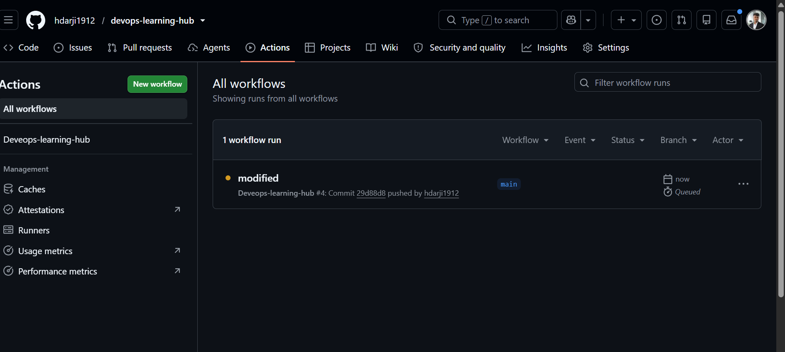
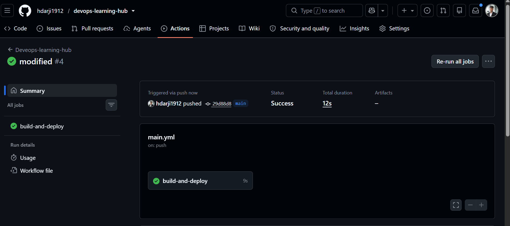
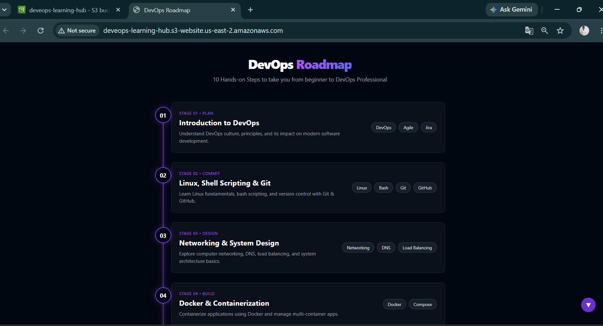

# 🚀 DevOps Learning Hub

> A hands-on DevOps project demonstrating automated deployment of a static website to AWS S3 using GitHub Actions CI/CD.


---

## 📖 Overview

**DevOps Learning Hub** is a practical project built to demonstrate modern DevOps practices using AWS Cloud and GitHub Actions.

Whenever code is pushed to the **main** branch, GitHub Actions automatically deploys the latest version of the website to an Amazon S3 bucket, eliminating manual deployment and ensuring a fast, reliable CI/CD workflow.

---

## ✨ Features

- 🚀 Automated CI/CD Pipeline
- ☁️ AWS S3 Static Website Hosting
- 🔒 Secure AWS Authentication using GitHub Secrets
- ⚡ Automatic Deployment on Every Push
- 📦 Version Control with Git & GitHub
- 🌐 Responsive Static Website
- 🛠 Production-Ready Project Structure

---

## 🛠 Tech Stack

| Category | Technology |
|----------|------------|
| Frontend | HTML5, CSS3, JavaScript |
| Version Control | Git, GitHub |
| CI/CD | GitHub Actions |
| Cloud | Amazon Web Services (AWS) |
| Storage | Amazon S3 |
| Security | IAM, GitHub Secrets |

---

## 📂 Project Structure

```text
deveops-learning-hub/
│
├── .github/
│   └── workflows/
│       └── main.yml
│
├── assets/-ss
├── index.html
├── README.md
└── LICENSE
```

---

## ⚙️ CI/CD Workflow

```text
Developer
     │
     ▼
GitHub Repository
     │
     ▼
GitHub Actions
     │
     ▼
Configure AWS Credentials
     │
     ▼
Build & Deploy
     │
     ▼
Amazon S3
     │
     ▼
Live Website
```

---

## 📚 Skills Demonstrated

- Git & GitHub
- GitHub Actions
- Continuous Integration (CI)
- Continuous Deployment (CD)
- AWS IAM
- Amazon S3
- Static Website Hosting
- Secure Secret Management
- Cloud Deployment
- DevOps Best Practices

---

## 🚀 Getting Started

### Clone the Repository

```bash
git clone https://github.com/hdarji1912/devops-learning-hub.git
```

### Navigate into the Project

```bash
cd deveops-learning-hub
```

## 🔐 GitHub Secrets

Configure the following secrets in your GitHub repository:

| Secret | Description |
|---------|-------------|
| AWS_ACCESS_KEY_ID | AWS IAM Access Key |
| AWS_SECRET_ACCESS_KEY | AWS IAM Secret Key |
| AWS_REGION | AWS Region (e.g. us-east-2) |

---

## 📈 Future Improvements

- Docker Containerization
- Kubernetes Deployment
- Terraform Infrastructure as Code
- AWS CloudFront CDN
- Route 53 Custom Domain
- HTTPS with AWS Certificate Manager
- Monitoring using CloudWatch
- Multi-Environment Deployment (Dev, Staging, Production)

---

## 📸 Project Preview

# DevOps Learning Hub







assets/images/successfull -action.png
---

## 👨‍💻 Author

**Hardik Darji**

Aspiring DevOps Engineer passionate about Cloud Computing, Automation, CI/CD, Docker, Kubernetes, AWS, and Infrastructure as Code.

- GitHub: https://github.com/hdarji1912

---

## ⭐ Support

If you found this project helpful, please consider giving it a ⭐ on GitHub.

---
